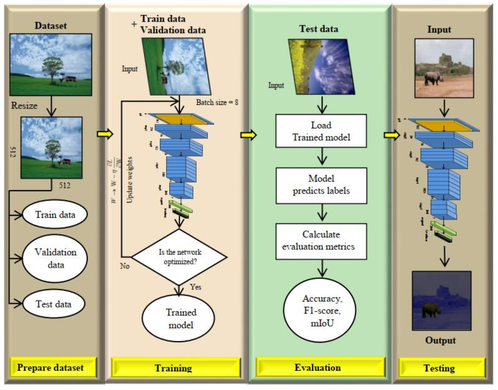
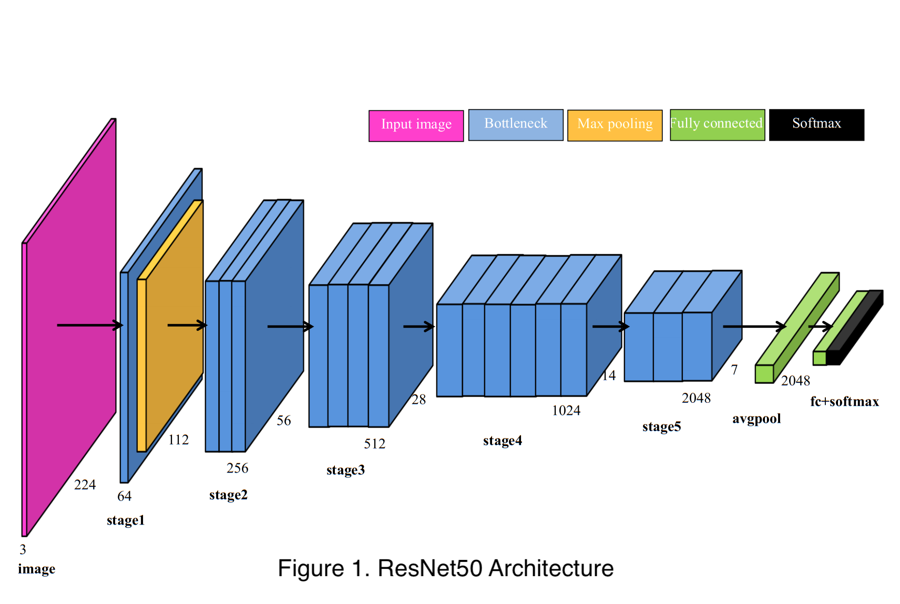
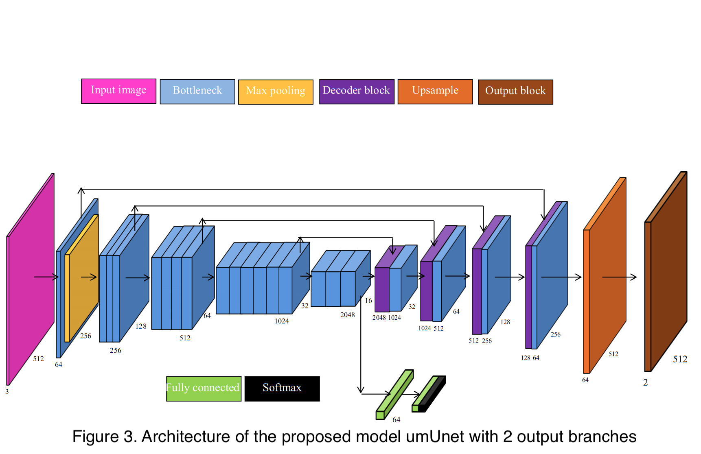

# Image Forgery Detection 

## Dataset
The dataset with the number of images we used in the project is presented in the picture below.

  

## Architecture
We implement three models, including Classification (ResNet50), Segmentation (modified UNet) and Unification (unified modified UNet).
+ ResNet50 is chosen for the classification task. The ResNet50 architecture is shown in Figure 1.
+ The segmentation network is plotted in Figure 2.
+ A proposed model that merges the two models above into a single model called umUNet (unified modified UNet). umUNet is depicted in Figure 3.

  
  
  

Figure 2. Architecture of the proposed model mUnet with 1 output branch.

  

Figure 3. Architecture of the proposed model umUnet with 2 output branches.

## Results
- Compare the predictions of two models: mUNet and umUNet.
- Each column is a data sample, while the rows represent the input image, surface label, mUNet surface prediction and umUNet surface prediction, respectively. 
As we can see, the segmented umUNet regions are sharper than those of mUNet.

  
  

